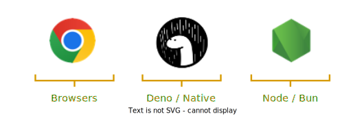
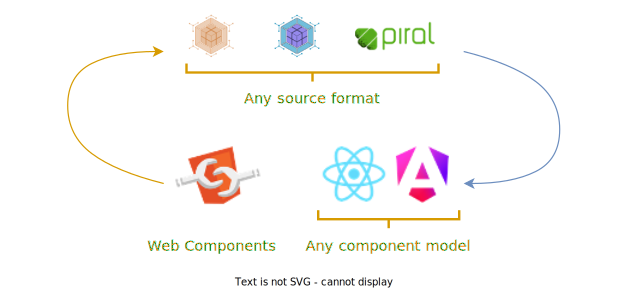
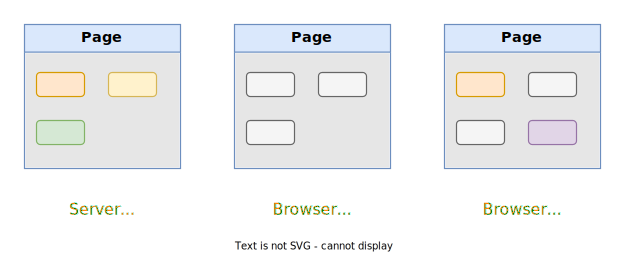

# Features

Picard.js is your comprehensive solution for orchestrating micro frontends, providing a flexible, robust, and efficient library to manage complex web applications across various platforms, formats, and frameworks.

## Multi Platform

Picard.js is designed to be versatile and adaptable across various environments. Whether you're working in a browser, Node.js, Deno, or Electron, Picard.js seamlessly orchestrates micro frontends, ensuring consistent performance and compatibility.

:point_right: Want to see this in action? [Example online](https://github.com/picardjs/picard/blob/develop/examples/08-ssr-tractor/package.json)

## Multi Format

With Picard.js, you can integrate and manage multiple micro frontend formats effortlessly. It supports Module Federation, Native Federation, Pilets, and more, providing flexibility and ease of use for diverse development needs.

:point_right: Want to see this in action? [Example online](https://github.com/picardjs/picard/blob/main/examples/10-dependencies-sharing/index.html)

## Multi Framework

Picard.js excels at integrating various frameworks, including single-spa, HTML fragments, and web components. This multi-framework support allows you to choose the best tools for each part of your application, fostering innovation and efficiency.

:point_right: Want to see this in action? [Example online](https://github.com/picardjs/picard/blob/develop/examples/06-static-page-single-spa/index.html)

## Error Handling

Picard.js takes the hassle out of managing errors. It automatically handles errors across your micro frontends, ensuring a smooth and uninterrupted user experience while reducing the need for manual error management.

:point_right: Want to see this in action? [Example online](https://github.com/picardjs/picard/blob/main/examples/06-static-page-single-spa/mfs/red/src/Product.jsx#L87)

## Loose and Strong Coupling

Picard.js supports both loose and strong coupling of micro frontends. Utilize a micro frontend discovery service for loose coupling or specify script URLs directly for strong coupling, akin to module federation, allowing you to tailor the integration to your specific requirements.

:point_right: Want to see this in action? [Example online](https://github.com/picardjs/picard/blob/develop/examples/02-static-page-feed/index.html#L10)

## Optional Routing

Picard.js provides robust routing capabilities, whether you need client-side or server-side routing. This flexibility enables you to design your application's navigation in the most efficient and effective way possible.

:point_right: Want to see this in action? [Example online](https://github.com/picardjs/picard/blob/develop/examples/05-static-page-with-routing/index.html#L11)

## Debugging

Debugging with Picard.js is straightforward and integrates seamlessly into your existing development workflows. It supports native debugging processes and extends compatibility with micro frontend debugging utilities such as the [Piral Inspector](https://github.com/smapiot/piral-inspector), enhancing your ability to identify and resolve issues quickly.

## Islands Architecture

Picard.js facilitates the creation of island architectures, enabling server-side rendered (SSR) applications that can hydrate and continue on the client side. This approach optimizes performance and user experience, combining the best of SSR and client-side rendering.

:point_right: Want to see this in action? [Example online](https://github.com/picardjs/picard/blob/develop/examples/09-islands-netflix/package.json)
