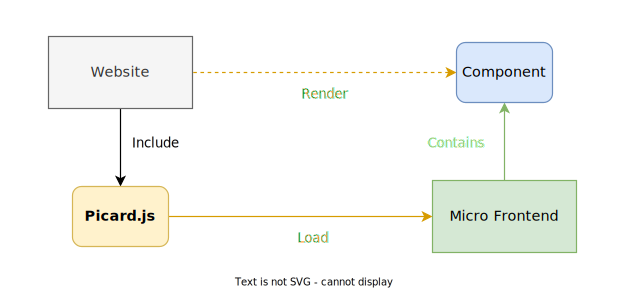

# Getting Started

Picard.js is a micro frontend orchestrator. This means, that the job of Picard.js is to load micro frontends, run them, and mount, update, unmount the components exposed by the micro frontends.



Picard.js exists as a drop-in script for your website, as well as a module that you can include in your application.

Here is how to include the drop-in script in your website:

```html
<script src="https://unpkg.com/picard-js"></script>
```

This will automatically set up and run Picard.js on your website.

::: tip
Alternatively, if you don't like unpkg you can also use jsdelivr:

```html
<script src="https://cdn.jsdelivr.net/npm/picard-js"></script>
```

In fact, any CDN that uses npm as a source will work.
:::

Now start creating regions in the HTML for the components of the micro frontends you'd like to display:

```html
<pi-component
  name="MyComponent"
  source="https://yourcompany.com/example/remoteEntry.js"
  format="module"
  remote-name="example"
></pi-component>
```

The `pi-component` web component acts as a container element to display the content brought in by the component (in this case `MyComponent`) of the referenced micro frontend (specified by its `source`, `format`, and - necessary in this case - `remote-name`).

Since Picard.js only exposes web components you can always safely write them in your HTML. Worst thing that can happen is that nothing renders.

That's it for the basics :tada:!

Let's go into more details.
