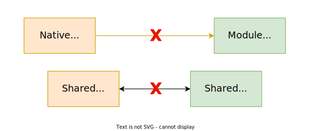
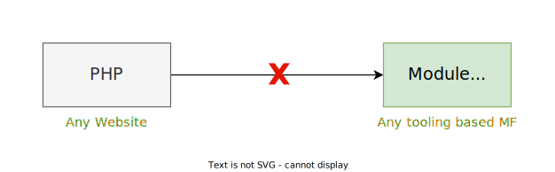

# Why Picard.js?

## The Problems

Today, a rich collection of libraries, tools, and frameworks for creating micro frontends exist. The problem usually do not occur when a micro frontend is created using a specific technology - they usually occur when a micro frontend should be *integrated* into an existing solution.

**Picard.js** enables integration of micro frontends independent of their technology or exposed functionality. It allows you to work with a central directory of micro frontends (e.g., retrieved from a micro frontend discovery service), as well as directly with an URL leading to a micro frontend.

### Interoperability

One of the reasons why Picard.js might be interesting for you is that it allows to easily bring in micro frontends. So, instead of requiring to set up some bundler or go into specifics, all you need to do is grab a script and add a web component. That's it!

For owners of existing micro frontend solutions the integration of other micro frontends will no longer break due to technology incompatibilities. If two micro frontends have been written - one using Module Federation and another one using Native Federation - you will no longer require some frankenstein solution, but instead can just embed both; and it will just work.

:point_right: Want to see this in action? [Example online](https://github.com/picardjs/picard/blob/main/examples/10-dependencies-sharing/index.html)

### Error Handling

Error handling has been one of the largest problems in solutions like Module Federation or Native Federation. The low-level nature of these building blocks ensured that you'd need to build something from the beginning. Unfortunately, this meant that you are rather creating and maintaining a micro frontend framework than actually solving a business problem.

With Picard.js error handling is integrated from the ground up. You reference an invalid component? Nothing bad will happen. The component crashes or does not accept the given inputs? The solution will just continue - if you care you can pick up the error and display something else instead.

:point_right: Want to see this in action? [Example online](https://github.com/picardjs/picard/blob/main/examples/06-static-page-single-spa/mfs/red/src/Product.jsx#L87)

### Technology Agnostic

A design goal of Picard.js was to work without any tooling. As such owners of existing projects (let's say an existing page created with PHP or some other SSR technology such as ASP.NET) don't need to integrate additional tooling. They just add some additional markup to their generated HTML response and everything works.

One advantage of this approach is that - out-of-the-box - Picard.js is technology agnostic. While other approaches require specific tooling to work we don't need this here. As a result, Picard.js can also be used with tooling that is rather micro frontend hostile such as the Angular CLI. As long as there is some HTML somewhere you can add the script and use the web components.

:point_right: Want to see this in action? [Example online](https://github.com/picardjs/picard/blob/main/examples/01-static-page/index.html)

## Why use a Library as Orchestrator?

Because a library is lightweight and does not stand in your way. Of course, you can use a full framework or invent your own thing (and in some scenarios that might be the right thing to do), but usually the orchestration itself should be *just* done. No questions asked.

**Picard.js** was developed to be as flexible as possible. You don't like the names of the web components (such as `pi-component`)? Just rename them! You already have a custom format for your micro frontends? Just use it then!

## How is Picard.js Different from X?

You can check out the [Comparisons](./comparisons.md) section for more details on how Vite differs from other similar tools.
